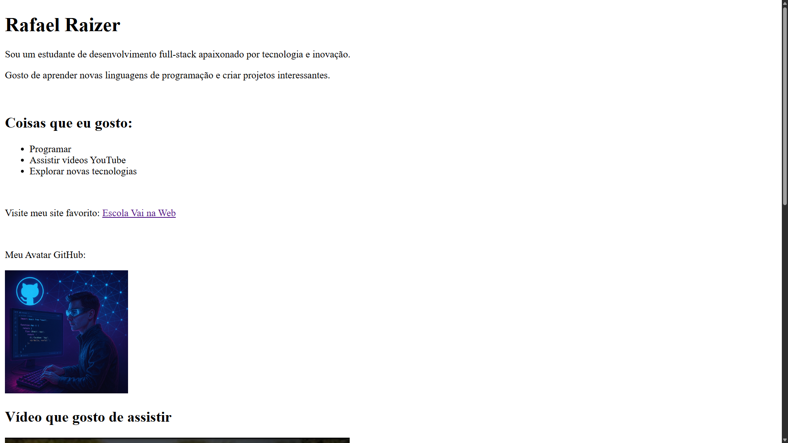

# Desafio HTML: Sua Primeira Página Web 🏆
 

  
[Demonstração-Desafio]  

***

 

# Índice 📚

- 🔹 [Objetivo](#objetivo)  
- 🔹 [Tarefas](#tarefas)  
  - 🟢 [Tarefas principais](#tarefas-principais)  
  - 🟢 [Bônus (opcional)](#bônus-opcional)  
- 🔹 [Tecnologias](#tecnologias)  
- 🔹 [Ferramentas](#ferramentas)  
- 🔹 [Como rodar o Front-End](#como-rodar-o-front-end)  
- 🔹 [Licença](#licença)  
- 🔹 [Autor](#autor)

***

 

### Objetivo

- Criar uma pequena página HTML usando apenas o que aprendemos hoje!

### Tarefas

#### Tarefas principais

📝 Tarefas principais:

- Crie um arquivo `sobre_mim.html`  
- Use a estrutura básica do HTML (`<!DOCTYPE>`, `<html>`, `<head>`, `<body>`)  
- Inclua:
  - Um título principal com seu nome  
  - Dois parágrafos sobre você  
  - Uma lista de 3 coisas que você gosta  
  - Um link para um site que você curte  

#### Bônus (opcional)

🏅 Bônus (opcional):

- 🖼️ Adicione uma imagem sua ou de algo que você goste  
- 🌐 Incorpore um vídeo do YouTube que represente você ou algum conteúdo que goste de assistir  
- 🗺️ Adicione um mapa da sua cidade com o Google Maps usando um `<iframe>`  
- 📝 Altere o título da aba do navegador  

 

***

### Tecnologias

  

Tecnologias utilizadas no projeto:

- HTML5 — [translate:Linguagem de marcação utilizada para a construção das páginas web]

 

***

### Ferramentas

  

Ferramenta utilizada no projeto:

- [VsCode](https://code.visualstudio.com/download) (v1.80.1)  

 

***

### Como rodar o Front-End

  

- No arquivo `index.html` clique com o botão direito e selecione:  
Open With Live Server

- Assim abrirá no navegador o desafio HTML com o título: `Sobre Mim!`

 

***

### Licença

- Esse projeto está sob a licença MIT.

***

  

### Autor

  
  
&nbsp;&nbsp;&nbsp;RafaRaizer-Dev 
  &nbsp;&nbsp;&nbsp;<a href="https://api.whatsapp.com/send/?phone=47999327137">Whatsapp</a> | <a href="https://www.linkedin.com/in/raizer-rafael/">LinkedIn</a> | <a href="https://github.com/RaizerTechDev">GitHub</a> | <a href="https://public.tableau.com/app/profile/rafael.raizer">Tableau</a> | <a href="https://raizertechdev-portfolio.netlify.app/">Portfólio</a>  
  

